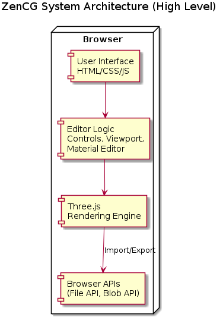
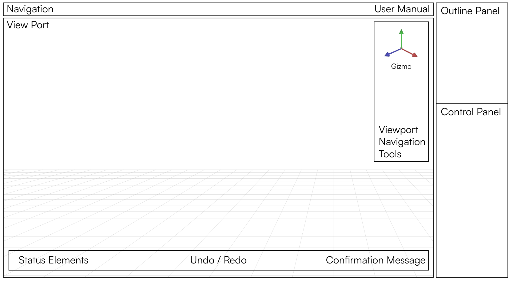
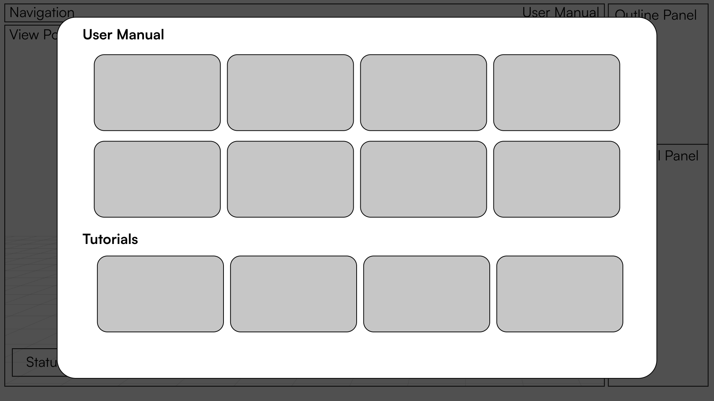
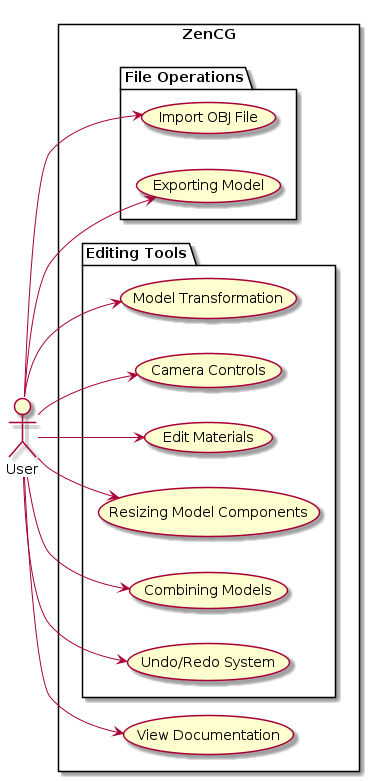
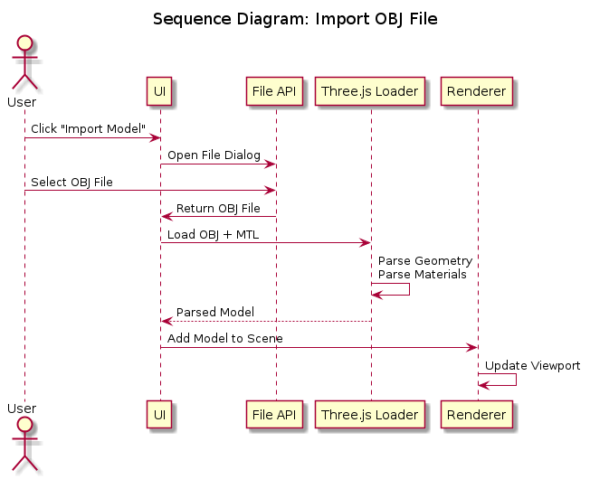
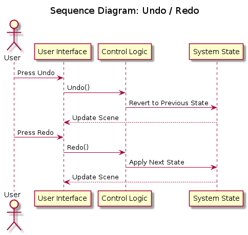
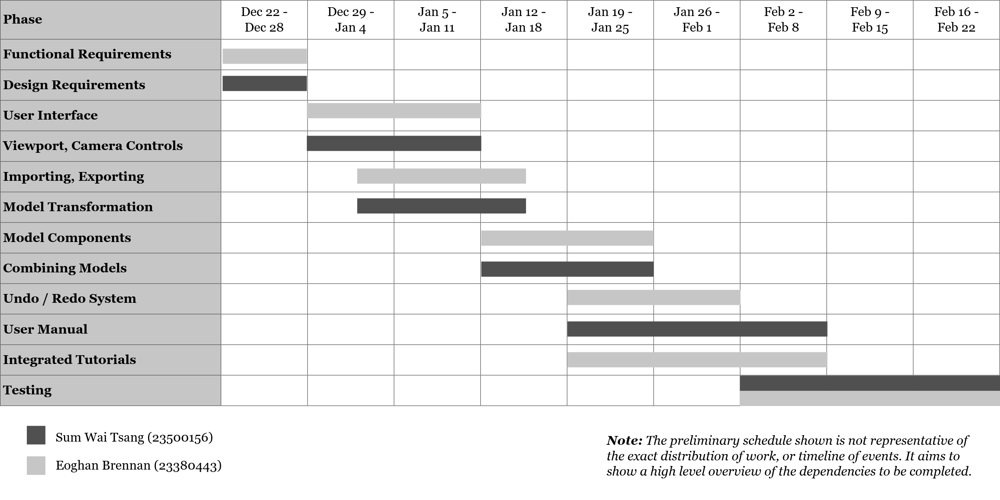

# ZenCG 3D Model Editor Web Application

Prepared by Eoghan Brennan (23380443) and Sum Wai Tsang (23500156)

**Version 1.0**  

28/11/2025

---
# Table of Contents

[[_TOC_]]

---
# Revision History

| Name          | Date     | Reason For Changes        | Version     |
| ------------- | -------- | ------------------------- | ----------- |
| First Version | 28/11/25 | Initial Document Creation | Version 1.0 |

---
# 1. Introduction
## 1.1 Purpose

The purpose of this document is to define the software requirements for ZenCG, a web-based 3D model editor application. ZenCG allows users to import, view, edit and export 3D models in OBJ format. The application provides tools for editing geometry, reshaping and resizing components of the model, adjusting materials and colours, and combining multiple models.

This SRS specifies the full functionality of ZenCG, and all non-functional requirements. It specifies the requirements for the user interface, rendering environment and editing tools. This document serves as a reference for the developers and users of the editor to ensure that the software satisfies the intended goals.
## 1.2 Document Conventions

This document will follow a consistent format to ensure clarity throughout the document. All headings and subheadings within the document will have larger text size along with bold text to make every section easily differentiated from each other. Plain language has been used to make the document understandable for everyone.

Each requirement in this document is written as a clear statement. Whether a requirement is functional or non-functional is very clear as they are listed separately from each other. All references to external sources used in our project such as OBJ file documentation will be cited under established citing conventions.
## 1.3 Intended Audience and Reading Suggestions

The document is intended for all stakeholders involved in the review of ZenCG. The primary audience includes the developers designing the application, and testers who will verify that ZenCG meets all the requirements listed in the document. Users of the final product can refer to it to understand the development process and expected functionality.

Readers are encouraged to view this document in its intended structure to gain a broad understanding of the product before proceeding to the detailed requirements. Developers and testers should focus on the requirements listed to understand how ZenCG will work.  
## 1.4 Product Scope

ZenCG is a web application designed to allow users to import, view, modify and export 3D models in OBJ format. The purpose of this product is to allow users with little to no 3D modelling experience to easily edit pre-existing models. This will provide use for jobs such as interior designing, video game designing and engineering. The editor focuses on accessibility making it suitable for anyone who needs a lightweight tool for simple 3D editing without the use of expensive hardware or editing experience.

The key objectives are to deliver a user-friendly interface and efficient handling of OBJ files. It allows users to make quick changes to 3D models for visualisation, prototyping or educational purposes. By offering an uncomplicated yet functional 3D model editor, it encourages hands-on learning in 3D model editing.
## 1.5 References

[1] B1. Object Files (.obj). (n.d.). Available at: [https://paulbourke.net/dataformats/obj/obj_spec.pdf](https://paulbourke.net/dataformats/obj/obj_spec.pdf)

‌[2] Wikipedia Contributors (2019). Blender (software). Wikipedia. Available at: [https://en.wikipedia.org/wiki/Blender_(software)](https://en.wikipedia.org/wiki/Blender_\(software\)) (Accessed: 9 November 2025).

[3] Autodesk.com. (2021). Buy Autodesk Maya 2026 Software | 3D Animation Software. Available at: [https://www.autodesk.com/eu/products/maya/overview](https://www.autodesk.com/eu/products/maya/overview) (Accessed: 9 November 2025).

[4] Access Creative College. (2024). Blender vs Maya: What is the best student tool in 2025? - ACC. Available at: [https://www.accesscreative.ac.uk/blog/blender-vs-maya-what-is-best-2025/](https://www.accesscreative.ac.uk/blog/blender-vs-maya-what-is-best-2025/) (Accessed: 9 November 2025).

[5] Blender Project (n.d.) Accessibility – Voluntary Product Accessibility Template (VPAT). Available at: [https://projects.blender.org/attachments/dd33e8c7-d2e9-4693-96be-9e794c3b47f4](https://projects.blender.org/attachments/dd33e8c7-d2e9-4693-96be-9e794c3b47f4) (Accessed: 9 November 2025).

---
# 2. Overall Description

## 2.1 Product Perspective

### 2.1.1 ZenCG Context

The proposed system, **ZenCG**, is a new self-contained web-based 3D model editing application designed to run in modern web browsers. It operates on client side architecture. It will be evaluated against **Blender**, a free and open-source 3D computer graphics suite [2], which provides a reference for which we will derive our system’s design, and justification for development. Our product aims to improve usability to greatly enhance the 3D creation experience for beginners, and accessibility to bring up the system’s ease of use.

ZenCG is not a replacement for existing suites, but rather it aims to provide an alternative entry path for users who want to learn computer graphics without the pre-requisite technological literacy required to navigate complex software, such as Blender, or industry standards like **Maya**, which also have a tremendous cost.

Blender is our main system of evaluation for our proposed project. The reason why we did not choose other existing systems to evaluate is because those systems typically require subscription plans. For instance Maya is priced at €180/month for an annual subscription and €273/month for a monthly subscription [3]. This substantial pricing makes professional-grade software unrealistic for beginners to use to learn 3D computer graphics development. Blender is comprehensive and widely used professionally, comparable with industry standards or paid software. This contributes to Blender being the perfect candidate to assess, derive, and reference, aiding in the development of our proposed system.
### 2.1.2 Blender

Blender is a free and open-source 3D computer graphics suite developed by the Blender Foundation. It features several key functionalities, including 3D modelling, modifiers, sculpting, geometry nodes, fluid simulation, cloth simulation, animation, and rendering. It is a popular tool for amateurs and professionals in industries like animation, game development, visual effects (VFX), and 3D printing.
### 2.1.3 Blender Evaluation

Blender, despite being robust with diverse features, has many limitations, especially for users new to 3D computer graphics. The user interface is intimidating, and makes simple tasks seem more difficult than they actually are. System navigation is unintuitive for beginners because of the complexity of the interface. Blender software struggles on older and entry-level devices. Blender is thus not optimized for older, lower specification machines.

Whilst evaluating Blender hands-on, there were deficiencies when it came to accessibility and user experience. To substantiate our claims on user-experience aligned accessibility flaws, we reference the *Blender Accessibility Conformance Report, EN 301 549 Edition, (Based on VPAT® Version 2.4Rev)*, dated March 1, 2023. This report will serve as our primary reference for the following section. The conformance level definition—Does Not Support, provides evidence of limitations and criterion defined as such will validate our arguments [5]. Despite the reports measuring accessibility for people with disabilities, multiple accessibility red flags reveal user experience issues that can subsequently affect beginners.

| Criteria                                                                 | Remarks and Explanations                                                                                          |
| ------------------------------------------------------------------------ | ----------------------------------------------------------------------------------------------------------------- |
| Criterion 4.2.10 Usage with limited cognition, language or learning      | “This software does not have a simplified interface suitable for those with cognitive and learning disabilities.” |
| Criterion 12.1.1 Accessibility and compatibility features                | “Software documentation does not specifically list or explain accessibility features.”                            |
| Criterion 12.2.2 Information on accessibility and compatibility features | “There is currently not a documentation area specifically for accessibility and compatibility features”           |

As detailed, Blender does not have a user interface accessible for those with cognitive or learning disabilities. We believe that improving comprehensibility with a simplified interface would also greatly benefit beginners. As such, ZenCG will emphasise usability, following any universal design principles to maximise the user experience for beginners, or those unfamiliar with 3D tools. Moreover, there is a lack of resources available that explain accessibility features. To subjugate confusion due to the lack of documentation, ZenCG will provide user manuals and software documentation. We will also integrate documentation information directly into the website. This will cover features that will make it easier for users to get any queries answered.

Although the client-side architecture does not fully resolve performance limitations of version 1.0 of ZenCG, a hybrid client-server architecture utilising cloud rendering farms is tracked as TBD-1 and is planned for Version 2.0. This mitigates hardware limitations for rendering.
### 2.1.4 System Overview

ZenCG is a web-based 3D model editing application. The system provides an accessible and intuitive environment for beginners. The focus is on accessibility, usability, user experience, performance, and simplicity. The system comes included with software documentation, integrated tutorials, and contextual documentation to guide users through all features.
## 2.2 Product Functions

This section provides a high level overview of the major functionalities of the system. Detailed requirements for each function are provided in section 4, system features.

### 2.2.1 Importing OBJ Files

The system shall allow users to import 3D models in the workspace.

- Import OBJ models into workspace.
- Automatically render geometry.
- Apply associated materials (MTL) for editing.

### 2.2.2 Model Transformation

The system shall allow users to reposition, rotate, and scale 3D models using controls and value inputs.

- Move and reposition OBJ models.
- Rotate imported models in every axis (X, Y, Z).
- Scale models in all transformation types.
- Interactive controls within viewport (3D Transformation Gizmo).
- Input precise numerical input to transform models in workspace.

### 2.2.3 Camera Controls

The system shall allow users to orbit, pan, zoom, reset camera to navigate the viewport.

- Orbit around point in viewport.
- Pan view around the viewport.
- Zoom in and out within the viewport.
- Reset camera to default view.

### 2.2.4 Material Editing

The system shall allow users to edit colours, textures, and materials of 3D models.

- Set colour of model, and components.
- Apply textures to mesh.
- Adjust materials of mesh.

### 2.2.5 Resizing Model Components

The system shall allow users to resize components of a model.

- Resize individual components of a parent model.
- Maintaining mesh integrity and structural consistency.

### 2.2.6 Combining Models

The system shall allow users to merge 3D models.

- Merge multiple imported OBJ models.
- Merged models can be exported.
- Merged models can be further modified.

### 2.2.7 Exporting Models

The system shall allow users to export multiple 3D models.

- Export scenes as OBJ file.
- Preserve geometry information during export.
- Preserve material information during export.

### 2.2.8 Undo / Redo System

The system shall allow users to revert or reapply changes to 3D models or the system.

- Revert recent changes.
- Reapply recent changes.
- Action history management.
## 2.3 User Classes and Characteristics

ZenCG is designed to support multiple user classes. Each is differentiated based on their access level, frequency of use, technical expertise, and importance. Understanding this is crucial to ensure the system meets the requirements of our target market.

| User Class              | Description                                      | Access Level | Frequency of Use | Technical Expertise | Importance |
| ----------------------- | ------------------------------------------------ | ------------ | ---------------- | ------------------- | ---------- |
| Beginner User           | Users new to 3D creation                         | Standard     | High             | Low                 | Critical   |
| Intermediate User       | Users familiar with 3D creation (e.g. hobbyists) | Standard     | High             | Intermediate        | High       |
| Professional User       | Users who do 3D creation professionally          | Standard     | Low              | High                | Low        |
| Educational User        | Educators who teach 3D creation                  | Standard     | Medium           | Intermediate        | Medium     |
| Developer / Contributor | System developers and contributors               | Full         | High             | High                | Medium     |
## 2.4 Operating Environment

ZenCG operates as a static web application. All major functionalities occur within the client’s browser. A cloud rendering functionality that mitigates performance limitations is to be determined.
### 2.4.1 Client Environment

- Hardware: Device with GPU compatible with WebGL 2.0+.
- OS: Independent of Platform (Windows, macOS, Linux, iOS, Android).
- Browser: Chrome 90+, Firefox 88+, Safari 15+, Edge (Chromium).
- Technologies: HTML5, JavaScript, WebGL, Three.js.
### 2.4.2 Server Environment

For demonstration purposes, all server-side functionality will run locally, on the development machine. The local server will manage authentication, data persistence, and file storage.  
  
The computational layer is adjourned, as highlighted in TBD-1, cloud-rendering is out of scope in version 1.0 of ZenCG. Rendering will take place client-side for demonstration purposes. All rendering, interaction, and data persistence occur within the client browser.

- Hosting: Local development server.
- Storage: Object storage for models and textures (Local filesystem for 3D models, textures, and exported projects).

**Figure 2.4.1 High Level Overview of System Architecture**
## 2.5 Design and Implementation Constraints

ZenCG is subject to many design and implementation constraints, which ensure system functionality, maintainability, and compatibility. There are constraints due to the system requirements, such as being browser-based, and limited to selected technologies.
### 2.5.1 Hardware Constraints

- The device GPU must support WebGL 2.0+.
- Performance is dependent on device CPU, GPU, and memory.
- Designed specifically for computers, such as laptops and PCs.
- Mobile devices and tablets are out of scope.
### 2.5.2 Software Constraints

- Browsers must be up to date.
- The backend will be Node.js.
- The backend database will be SQLite.
- Only supports WebGL, Three.js.
- Only supports OBJ and MTL formats.

### 2.5.3 Architectural Constraints

- Client-side architecture.
- Static web application.
- Local server during development.
- HTTP/HTTPS requests for client-server communication.
- User data stored locally using browser APIs.
### 2.5.4 Interface Constraints

- Browser File API and Blob API, to manage file input and file output.
- User Interface must follow typical browser event models (mouse, keyboard, touch), limiting the design of custom input systems.
- The user interface must follow universal design guidelines.
## 2.6 User Documentation

The system will include user documentation to support beginners. Also to ensure all users can understand the system without effort, or searching for answers.
### 2.6.1 Integrated Tutorials

Interactive demonstration of system functionality and interface for beginners. A tour of the interface for new users. 

- Interactive guide of key functionality and features for new users with the app.
- Basic tutorials to teach the user how to interact with the system controls.
- Tutorials for importing and exporting OBJ files.
- Tutorials for editing models and applying transformations.
### 2.6.2 User Manual

In depth user manual (5-10 pages), which is a guide on ZenCG. It introduces the user to the system and explains the features of the system.

- System introduction
- User interface overview
- Functionality overview
- File format overview
- Import/Export overview
- OBJ file editing overview
- Frequently asked questions
## 2.7 Assumptions and Dependencies

### 2.7.1 Assumptions

The development of the system assumes the following conditions:

- Adequate hardware capabilities.
- Access to up-to-date, WebGL-compatible browsers.
- Browser is JavaScript compatible and can support GPU rendering.
- Stable internet connection during system use.
- Basic familiarity with foundational 3D concepts.

### 2.7.2 Dependencies

The development of the system depends on the following conditions:

- Three.js for real-time 3D rendering.
- Camera interaction tools, material management, lighting.
- WebGL support for browsers.
- Browser File APIs for importing/exporting OBJ files.

---
# 3. External Interface Requirements

## 3.1 User Interfaces

The 3D model editor offers a browser-based user interface that allows users to interact with 3D models through an intuitive and accessible layout. The app will follow modern user interface design standards and will be clean and minimal similar to other web applications. ZenCG’s interface will be composed of several components, each designed to support different features of the app.

The main workspace will consist of a 3D plane where imported models are displayed. Users can rotate the camera by clicking and dragging with their mouse, they can zoom in and out with the mouse wheel and pan the camera using middle click. There will be visual indicators such as an axis to help users with orientation. Rendering updates will occur in real time so that all edits are immediately visible.

A side panel will be accessible which will provide access to editing tools including importing models, changing materials and colours and scaling model components, combining models and exporting final models. Common actions such as undo and redo will be on the side panel as well. The interface will include status elements, which will highlight errors or tooltips when hovering over controls. There will also be confirmation messages once an edit is made.

**Figure 3.1.1 Main Workspace Wireframe Prototype**

**Figure 3.1.2 Integrated User Manual and Tutorials Wireframe Prototype**
## 3.2 Hardware Interfaces

ZenCG is a web based application built using Three.js which would rely on the devices hardware through WebGL rendering. It doesn’t depend on the hardware specifically but depends on the capabilities of the web browser and operating system. 

Three.js does require a GPU that supports WebGL. Entry level GPUs can handle simple and small OBJ models whereas higher level GPUs can support models of much larger scales. No external devices or specialist hardware drivers are needed for the application because Three.js isolates the low-level GPU interactions . The editor's performance will be impacted by system requirements like CPU speed and available memory, particularly when loading big OBJ files. However, the software does not impose any strict hardware restrictions beyond what is required to run a contemporary WebGL-compatible browser.

The software supports standard input hardware (the mouse and keyboard). The mouse is used for selecting objects and controlling the camera. The keyboard is used for shortcuts and text input.

## 3.3 Software Interfaces

The app runs on a modern web browser (such as Google Chrome or Firefox) which provides WebGL, File API for importing/exporting OBJ and MTL files and Event APIs for handling input. The browser is the hosting environment and must support JavaScript and WebGL in order for ZenCG to work.

The 3D functionality relies on Three.js which will render OBJ and MTL files along with rendering the camera controls and utility functions in real time. It abstracts GPU interactions and communicates with WebGL. The app interacts with OBJ and MTL files supplied by the user. 

The editor interacts with external file formats which are supplied by the user. The user inputs OBJ and MTL files and texture images and the editor outputs the edited OBJ and MTL files.
## 3.4 Communications Interfaces

ZenCG operates as a client-side web application and doesn’t require network communication for its core functionality. HTTPS is the primary communication method and is used for security ensuring all data is encrypted. When uploading files, Multipart HTTP POST is used and HTTP GET is used for retrieving stored assets. HTTP protocols are used initially to transfer application assets like (HTML, JavaScript, Three.js) Files are handled locally using the Browser File API and Blob API.

---
# 4. System Features
## 4.1 Importing OBJ Files
### 4.1.1 Description and Priority

This allows the user to import OBJ files so they can edit them. Users select an OBJ file from their storage and the system renders its geometry and its texture (through its complementary MTL file). The model appears in the 3D plan ready for editing.

**Priority:** High (the core requirement of the application)

**Benefit:** 10

**Penalty:** 10

**Cost:** 3

**Risk:** 3  
  
### 4.1.2 Stimulus/Response Sequences

**User Action:** User clicks Import Model.

**System Response:** File selection dialog appears.

**User Action:** User selects an OBJ file from their storage.

**System Response:** The system reads the file and renders its geometry. If an MTL file is referenced, the system loads it. The model is then displayed on a 3D plane.

**User Action:** User selects a file with missing material references.

**System Response:** System loads the geometry only and a warning message appears that the material info could not be found.

**User Action:** User selects an invalid or corrupted  OBJ file.

**System Response:** System displays an error message and model is not added to the scene.

### 4.1.3 Functional Requirements

**IMP-REQ-1:** The system allows users to import OBJ files.

**IMP-REQ-2:** The system parses all geometry from the OBJ file.

**IMP-REQ-3:** The system detects and loads MTL files when referenced by the OBJ file.

**IMP-REQ-4:** The system displays the model in a 3D viewport.

**IMP-REQ-5:** The system displays a warning message if a referenced MTL file is not found.

**IMP-REQ-6:** The system displays an error message if the OBJ file is corrupted/unreadable.

**IMP-REQ-7:** The system displays an error message if the file is not of OBJ format.

**IMP-REQ-8:** The system shall prompt the user to manually select any texture images (PNG or JPG) referenced in the loaded MTL file.
## 4.2 Model Transformation
### 4.2.1 Description and Priority

This allows the user to move, rotate and scale imported OBJ files

**Priority:** High

**Benefit:** 9

**Penalty:** 8

**Cost:** 5

**Risk:** 4
### 4.2.2 Stimulus/Response Sequences

**User Action:** User selects model.

**System Response:** System highlights model and displays transformation handles.

**User Action:** User drags controls.

**System Response:** System updates the models position, rotation and scale in real time.

**User Action:** User enters values manually.

**System Response:** System applies the exact transformation.  

### 4.2.3 Functional Requirements  
  

**TRA-REQ-1:** The system allows users to translate the model along the axes.

**TRA-REQ-2:** The system allows users to rotate the models on all axes.

**TRA-REQ-3:** The system allows users to scale models uniformly/non-uniformly.

**TRA-REQ-4:** The system updates the model in the 3D viewport in real time.

**TRA-REQ-5:** The system provides transformation controls.

**TRA-REQ-6:** The system allows input of numeric transform values.

**TRA-REQ-7:** The system shall allow the model to snap to the grid.

## 4.3 Camera Controls
### 4.3.1 Description and Priority

This allows the user to view the model using orbit, pan and zoom controls.

**Priority:** High

**Benefit:** 8

**Penalty:** 6

**Cost:** 3

**Risk:** 3  
### 4.3.2 Stimulus/Response Sequences  

**User Action:** User drags the mouse using left click.

**System Response:** The camera orbits the scene.

**User Action:** User scrolls.

**System Response:** Camera zooms in and out.

**User Action:** User middle-click holds.

**System Response:** Camera pans.

**User Action:** User clicks Reset Camera.

**System Response:** Camera resets to default view.  
  
### 4.3.3 Functional Requirements  
  
**CAM-REQ-1:** The system allows users to orbit a model around a focal point.

**CAM-REQ-2:** The system allows users to zoom in and out.

**CAM-REQ-3:** The system allows users to pan the camera.

**CAM-REQ-4:** The system shall have a reset camera function.

**CAM-REQ-5:** The system shall update camera movement smoothly.
## 4.4 Material Editing

### 4.4.1 Description and Priority

This allows the user to edit the colours, textures and material properties of the model.

**Priority:** Medium

**Benefit:** 6

**Penalty:** 5

**Cost:** 6

**Risk:** 5  
### 4.4.2 Stimulus/Response Sequences  

**User Action:** User selects model.

**System Response:** System shows material properties in the side panel.

**User Action:** User changes colour.

**System Response:** The viewport shows the updated coloured model.

**User Action:** User uploads texture.

**System Response:** System maps texture to model.  
### 4.4.3 Functional Requirements  

**MAT-REQ-1:** The system displays material settings when a model is selected.

**MAT-REQ-2:** The system allows users to change a model's base colour.

**MAT-REQ-3:** The system allows users to assign textures.

**MAT-REQ-4:** The system shall render changes of material in real time.

**MAT-REQ-5:** The system shall show a warning if a texture fails to load.

**MAT-REQ-6:** The system shall retain model proportions while mapping textures/colours.

## 4.5 Resizing Model Components

### 4.5.1 Description and Priority

This allows the user to alter dimensions of individual components of the entire model.

**Priority:** Medium

**Benefit:** 7

**Penalty:** 5

**Cost:** 7

**Risk:** 6  
### 4.5.2 Stimulus/Response Sequences  

**User Action:** User selects a model component.

**System Response:** System highlights it.

**User Action:** User drags resize handle.

**System Response:** System resizes and updates model.

**User Action:** User enters numeric values.

**System Response:** System resizes and updates model.  
### 4.5.3 Functional Requirements  

**RES-REQ-1:** The system allows users to scale objects or groups of an OBJ file.

**RES-REQ-2:** The system visually indicates selected parts of the model.

**RES-REQ-3:** The system supports numeric input for dimensions.

**RES-REQ-4:** The system shall maintain mesh integrity during resizing.
## 4.6 Combining Models
### 4.6.1 Description and Priority  
  
This allows the user to combine multiple OBJ files into a single model.

**Priority:** Medium

**Benefit:** 6

**Penalty:** 4

**Cost:** 7

**Risk:** 5  
### 4.6.2 Stimulus/Response Sequences  
  
**User Action:** User imports two or more models.

**System Response:** System adds them to the scene.

**User Action:** User saves scene with multiple models.

**System Response:** System outputs a single OBJ file with the multiple models.  
### 4.6.3 Functional Requirements

**COM-REQ-1:** The system supports multiple OBJ files in the same scene.

**COM-REQ-2:** The system allows users to save the multiple model scene as one OBJ file.

**COM-REQ-3:** The system shall maintain the geometry and materials of each model when combining.
## 4.7 Exporting Models
### 4.7.1 Description and Priority  
  
This allows the user to export the final model/scene into an OBJ file

**Priority:** High

**Benefit:** 10

**Penalty:** 9

**Cost:** 5

**Risk:** 5  

### 4.7.2 Stimulus/Response Sequences  

**User Action:** User clicks Export.

**System Response:** System prompts to save file.

**User Action:** User selects where to save file.

**System Response:** System downloads file.
### 4.7.3 Functional Requirements

**EXP-REQ-1:** The system exports the model as an OBJ file.

**EXP-REQ-2:** The system shall notify the user when the exporting is complete.

**EXP-REQ-3:** The system shall maintain the geometry and materials of each model when exporting.
## 4.8 Undo/Redo System
### 4.8.1 Description and Priority

This allows the user to revert/reapply recent actions

**Priority:** Medium

**Benefit:** 6

**Penalty:** 5

**Cost:** 6

**Risk:** 6  

### 4.8.2 Stimulus/Response Sequences  
  
**User Action:** User presses Undo.

**System Response:** System's previous state is restored.

**User Action:** User presses Redo.

**System Response:** Undone action reapplied.  

### 4.8.3 Functional Requirements  
  
**UNDO-REQ-1:** The system shall support Undo for any edit made.

**UNDO-REQ-2:** The system shall support Redo for any undone action.

**UNDO-REQ-3:** The system shall maintain an internal action history stack.

---
# 5. Other Non-functional Requirements
## 5.1 Performance Requirements

ZenCG must maintain a low-latency, and lag-free performance during all operations to ensure a consistent experience. As it runs inside a browser, the performance must be consistent across a range of consumer hardware, allowing users without high-end computers to use the application.

**PER-REQ-1:** The system shall maintain a minimum rendering framerate of 30FPS with a target of 60FPS.

**PER-REQ-2:** The system shall load OBJ files (under 50MB) within 10 seconds.

**PER-REQ-3:** The system shall respond to user actions within 100ms.

**PER-REQ-4:** Applying basic edits shall update the viewport in real time with no delay.

**PER-REQ-5:** The Undo/Redo state shall execute in under 1 second.
## 5.2 Safety Requirements

The system must ensure the safety of data and prevent loss of work unless wanted. As it is a web application, the safety requirements focus on protecting user-created data.

**SAF-REQ-1:** The system shall provide an automatic save tab when the user attempts to close or refresh the browser tab.

**SAF-REQ-2:** The system shall prevent loading of corrupted OBJ models to protect it from crashes.

**SAF-REQ-3:** The system shall prevent operations that exceed safe performance thresholds.

**SAF-REQ-4:** The system shall lock user input when performing long-running tasks (e.g exporting a big model) and display a loading indicator to prevent the user from issuing conflicting commands.
## 5.3 Security Requirements

The system must prevent unauthorized access to protect user data and ensure that file imports and exports do not introduce vulnerabilities. Since ZenCG runs on a web browser, security focuses on local data protection and safe handling of external files.

**SEC-REQ-1:** The system shall not upload user files to any external server.

**SEC-REQ-2:** The system shall validate all imported files to make sure they do not include any malicious script.
## 5.4 Software Quality Attributes

This describes the quality characteristics that ZenCG must meet in order to satisfy user expectations.

**QUA-REQ-1:** The system shall have a rendering engine independent of the platform.

**QUA-REQ-2:** Transformations shall produce mathematically correct results.

**QUA-REQ-3:** The system shall preserve model geometry and detailing for imports and exports regarding OBJ files.

**QUA-REQ-4:** The system UI shall adjust to many screen sizes.

**QUA-REQ-5:** The system shall run on any device supporting WebGL.

**QUA-REQ-6:** The system editor shall respond to user actions within 100ms.
## 5.5 Business Rules

This describes the business rules that ZenCG must adhere to, and standards or regulations that must be followed.

**BUS-REQ-1:** The system shall be free to use for all users.

**BUS-REQ-2:** The system shall prioritise usability and learnability.

**BUS-REQ-3:** The system shall support a maximum model size of 50MB to maintain stable performance, OBJ/MTL/Textures inclusive.

---
# 6. Other Requirements

This section defines additional requirements not covered elsewhere in the SRS.  

**OTH-REQ-1:** The UI shall support localization for English, with future capability for more languages.

**OTH-REQ-2:** The system shall function correctly over HTTPS and shall enforce secure connections.

**OTH-REQ-3:** The system must support the latest version of browsers with WebGL compatibility.

**OTH-REQ-4:** All third-party libraries such as Three.js must be clearly referenced and their licenses must be included in documentation.

---
# 7. Appendix

## 7.1 Glossary

**OBJ File:** Plain-text 3D model file format including vertex co-ordinates, face definitions, normal vectors and material references.

**MTL File:** A companion file to OBJ that defines colours, textures, transparency and lighting properties.

**Three.js:** A JavaScript 3D graphics library used for rendering models in a web browser using WebGL.

**WebGL:** A browser-based graphics API that allows rendering of 3D graphics using the hardware's GPU.

**3D Model:** A digital representation of an object. It has a height, width, and depth.

**Mesh:** 3D object composed of vertices, edges and faces.

**Vertex:** A single point in 3D space used to build meshes.

**Texture:** An image mapped onto a 3D model to give it colour and detail.

**Material:** A set of properties applied onto a mesh to control how it looks (color, shininess etc).

**Scene:** The virtual environment containing 3D objects, lighting and the camera.

**Viewport:** The space in which you are able to view the virtual environment/scene.

**Camera:** The viewpoint from which the user views the 3D scene.

**Transform:** Operations applied to mesh such as translation, rotation or scaling.

**UI (User Interface):** The visual elements through which the user interacts with ZenCG.

**SRS (Software Requirements Specification):** This document; defines all requirements for the system.

**FPS (Frames Per Second):** The amount of frames rendered by the GPU every second. Typical computers are capped at: 30, 60, 120, 144, 240, and 360 frames per second.
## 7.2 Analysis Models

### 7.2.1 Use Case Diagram 

**Figure 7.2.1 ZenCG Use Case Diagram**

### 7.2.2 Importing OBJ File Sequence Diagram

**Figure 7.2.2 Importing OBJ File Sequence Diagram**
### 7.2.3 Undo / Redo Sequence Diagram

**Figure 7.2.3 Undo and Redo Sequence Diagram**
## 7.3 To Be Determined List

**TBD-1**: Cloud Rendering Functionality (Section 2.1.3, 2.4.2). Computational layer requirement, for offshore rendering farm use. Intensive rendering tasks handled on the cloud, relieving client-side computational limitations.
## 7.4 Preliminary Schedule

**Figure 7.4.1 Importing OBJ File Sequence Diagram**